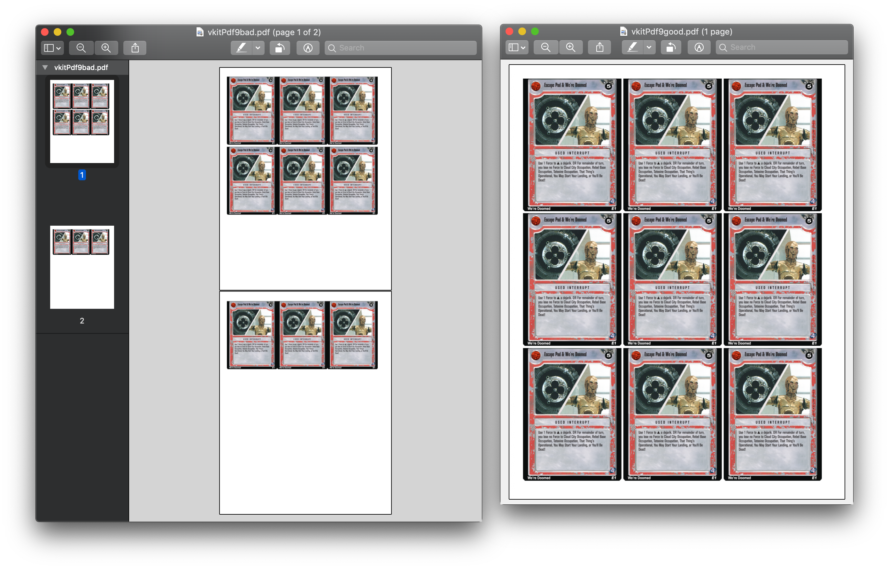
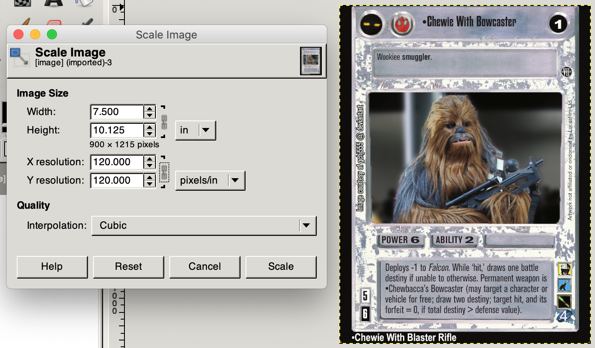

SWCCG VKit Images
=================

Virtual Slip Images used to power [vkit.starwarsccg.org](https://vkit.starwarsccg.org/)

## Naming Directories

* Each card gets a directory named after the card.
* All **Decipher** cards are named according to their name.
* All **Virtual** cards which overlay an existing card (of the same name) are named with the suffix `(V)` in their name. All other virtual cards do not need the (V) suffix
* Cards which have received **Errata** updates, _aka game text updates,_ are named with the suffix `(Errata)` in their name.

| `Darth Vader (Errata)` | `Darth Vader (V)` | `Escape Pod & We're Doomed` |
|-|-|-|
|  |  |  |

* Within each card directory name is a single file named: `image.png`

| `Darth Vader (Errata)/image.png` | `Darth Vader (V)/image.png` | `Escape Pod & Were Doomed (Errata)/image.png` |
|-|-|-|
| /image.png) | /image.png) | /image.png) |

## Size slips to print 9 per page

* A Virtual Slip that is full-sized, such as `Escape Pod & Were Doomed`, should be sized appropriately so that it can be printed 3x3 _(9)_ per page.

## Crop to content

* The full-sized image should not have any transparent blank space at the top. The image dimensions should be cropped to the image content.

